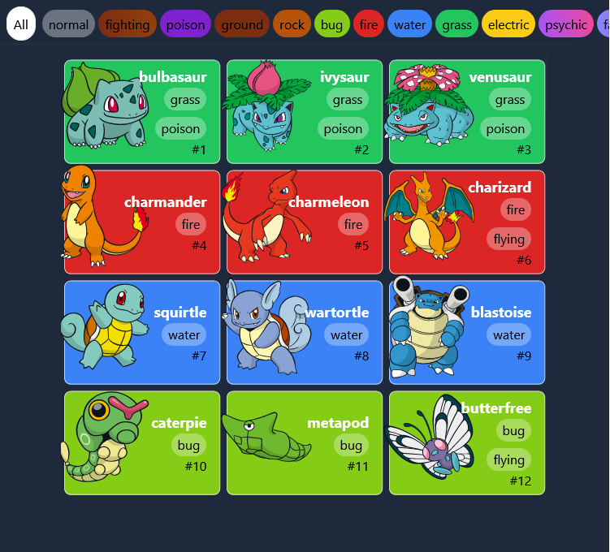
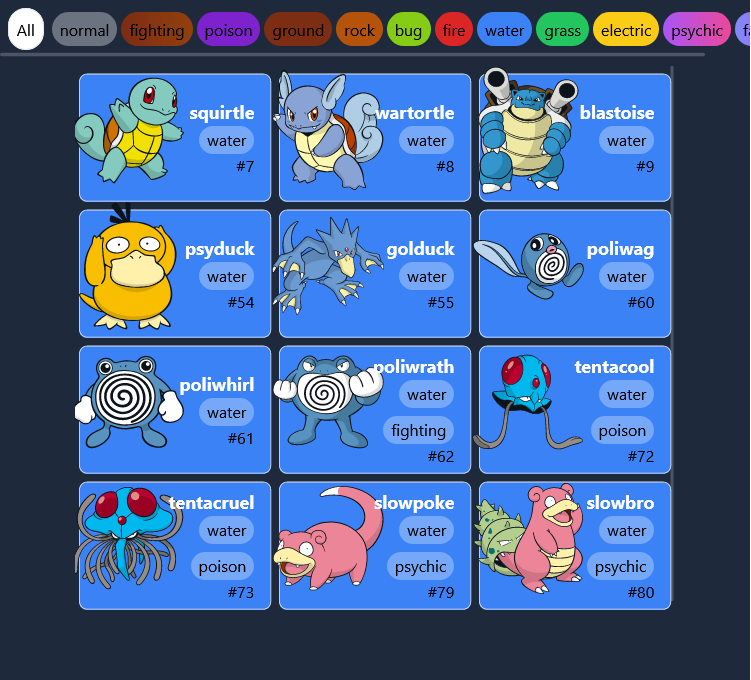

# Pokedex

Small application where you can see the pokemon and see them by types.

## Technologies
A list of technologies used within the project:
* [Tailwind](https://vitejs.dev/): Version 3.0.24 
* [Vite](https://tailwindcss.com/): Version 2.9.9
* [React.js](https://es.reactjs.org/) : Version 18

### Screenshot


## Installation
***
A little intro about the installation. 
```
$ git clone https://github.com/Dalex19/Pokedex-app.git
$ cd Pokedex-app
$ npm install or npm i
$ npm run dev
```